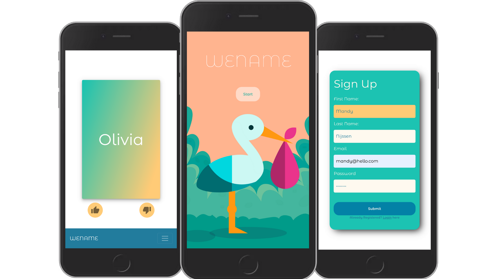
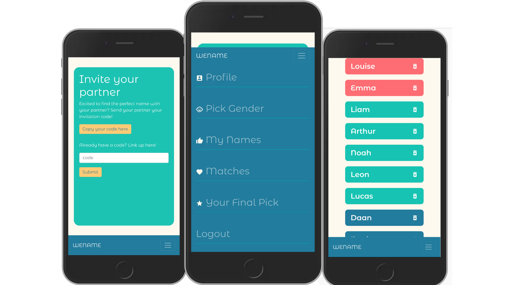

<p align="center">
  
</p>


WeName is a “Tinder for baby names” mobile-first application to let you and your partner find the perfect baby name.
Simply sign up and click or swipe to save your favourites. Invite your partner with a unique link and find our if you have matched names.

## Screenshots

<p align="center">
  
  
</p>


## Getting started

1. Clone the repo

```
git clone https://github.com/manij89/WeName
cd Wename
```

2. Install dependencies in client and server folder
```
npm install
```

3. Start it up
```
'npm start' in the client folder and 'node index.js' in the server folder.
Make sure you have all the necessary programs running (eg Postgres).
```

## Work in Progress ⚡️

* Currently build to be mobile-first. In process of making it fully responsive.
* Authentication

## Built with

* [React](https://reactjs.org/) - Front end library for building user interfaces
* [Redux](https://redux.js.org) - Storage to share data inside the app
* [Node.JS](https://nodejs.org/en/)
* [Sequelize](https://sequelize.org/master/) - promise-based Node.js ORM uses here with Postgres
* Drive and determination ♥


## Author

Mandy Nijssen - [Github](https://github.com/manij89/) - [LinkedIn](https://www.linkedin.com/in/mandy-nijssen/)

## Contributing

All improvements are welcome! 
Fork the repo and send a pull request.


## License

This project is licensed under the MIT License
